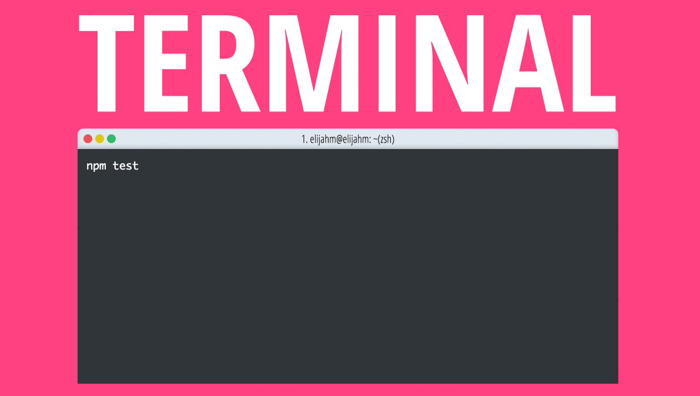

# spectacle-terminal

Terminal component that can be used in a spectacle slide deck

## Install

```
$ npm install --save spectacle
$ npm install --save spectacle-terminal
```

## Demo



[Interactive Demo](http://elijahmanor.github.com/spectacle-terminal)

## Usage

```jsx
import React from "react";
import { Spectacle, Deck, Slide, Heading } from "spectacle";
import createTheme from "spectacle/lib/themes/default";
import Terminal from "spectacle-terminal";

const theme = createTheme({ primary: "#ff4081" });

export default class Presentation extends React.Component {
  render() {
    return (
      <Spectacle theme={ theme }>
        <Deck transition={ [] } transitionDuration={ 0 } progress="bar">
          <Slide transition={[ "spin", "slide" ]} bgColor="primary">
            <Heading size={ 2 } caps fit textColor="tertiary">Terminal</Heading>
            <Terminal title="1. elijahm@elijahm: ~(zsh)" output={[
              "npm test",
              <div style={{ color: "#33B969"}}>TOTAL: 174 SUCCESS</div>,
              <div>
                <div>=============================== Coverage summary ===============================</div>
                <div style={{ color: "#DEC612"}}>Statements   : 51.29% ( 278/542 )</div>
                <div style={{ color: "#EE5057"}}>Branches     : 38.78% ( 95/245 )</div>
                <div style={{ color: "#EE5057"}}>Functions    : 46.21% ( 61/132 )</div>
                <div style={{ color: "#DEC612"}}>Lines        : 52.69% ( 274/520 )</div>
                <div>================================================================================</div>
              </div>]}
            />
          </Slide>
        </Deck>
      </Spectacle>
    );
  }
}
```